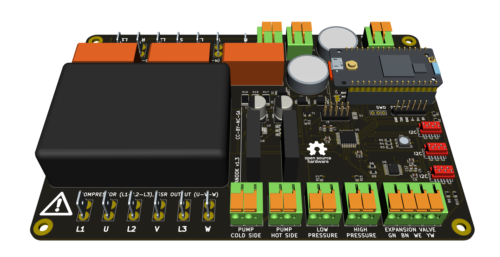
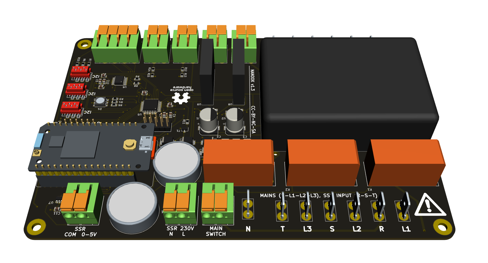
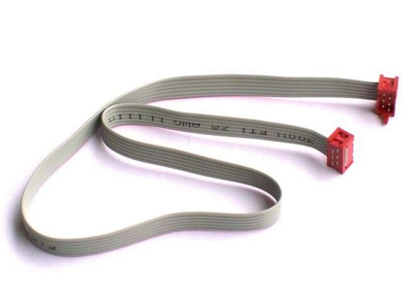
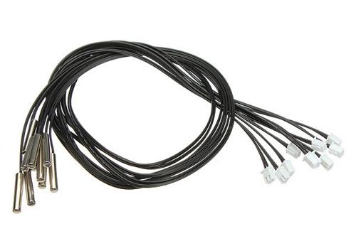
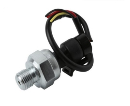
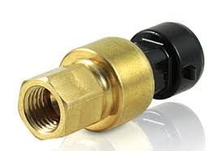
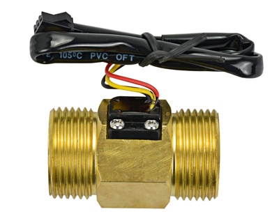
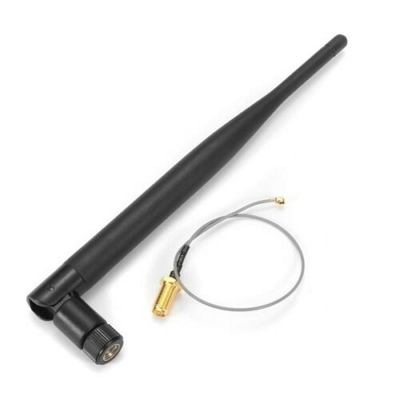

# NANOOK main control board

Nanook-mb is control board for open source [NANOOK ground-water heat pump](http://www.nanook.cc) project. The board is responsible for:

- soft-switching three phases compressor
- switching two circulation pumps
- controlling Carel Electronic Expansion Valve
- reading
  - safety low and high pressure switches
  - water temperature sensors on all exchanger ports (eight sensors in total)
  - water pressure sensors on cold and hot side
  - water flow sensors on cold and hot side
  - refrigerant pressure sensors on cold and hot side
- providing configuration web user interface via WiFi connection

## Safety warnings
TBD: grounding, connectors, switching (rocker vs. ext. CB)

## System connections

### Diagram

### Wiring

#### Mains to MB (#1)
Connection to mains is done by flexible cable 5x 2.5mm2. Mains side should be connected to on-wall box with dedicated circuit breaker (3x16A). Board side end must be terminated with insulated Faston 6.3 connectors and connected to L1, L2, L3 and N terminals of the board. To avoid contact with metal chassis, use angled Fastons only.

Ground wire must be terminated by crimp eye-type connector and mounted by screw to chassis.

### MB to compressor (#2)
This is, with #1, another high-current connection done by 3x 2.5mm2 cable. Both sides must be terminated by 6.3 Fastons. 

### MB to PWM SSR power lines (#3, #4)
These are six 2.5mm2 wires terminated by 6.3 Fastons on board side and by eye on SSR side. Make sure all six wires (R, S, T, U, V, W) are connected to properly.

### MB to ON/OFF switch (#5)
There is a rocker switch to turn heat pump ON and OFF. The switch just disconnects onboard power supply, which in turn opens onboard coil relays. This means that the board is still powered even with the rocker switch turned off.

### MB to PWM SSR control lines (#6, #7)
These lines connects main board and PWM SSR control circuit. Two lines supply the control circuit with 230V AC power (#6). The other two are control signal 0-5V. Leave SSR contacts 4-20mA and +5V unconnected.

### MB to circulation pumps (#8, #9)
The main board directly controls primary (cold) and secondary (hot) side circulation pumps. Onboard SSRs are rated to 100W max power output.

### MB to safety pressure switches (#10, #11)
Connections to safety pressure switches on low pressure and high pressure sides.

### MB to electronic expansion valve (#12)
For wires of EEV stepper motor. Color coding for Carel valves is marked on PCB:
- GN - green
- BN - brown
- WE - white
- YW - yellow.

### I2C bus (#13)
There are three connectors on board, all of them sharing single I2C bus. Analog sensor boards are connected by 6-wire flat cable with crimped Micro-Match connectors. 

There may be two separate cables for each analog sensors board, or there may be single cable shared by both analog sensors boards.

### Analog sensors board to temperature sensors (#14, #15, #16, #17, #24, #25, #26, #27)
Temperatures are measured by NTC 10K 1% 3950 thermistors.

There are waterproof thermistors with JST-XH connectors available. They may be used directly with no additional crimping needed.

Thermistors should be tightly mounted on appropriate pipes, ideally with thermal conductive paste and outer environment insulation cover.

Thermistors are located as follows:
- #14: "cold side refrigerant output" - evaporator refrigerant output to compressor suction
- #15: "cold side refrigerant input" - EEV to evaporator refrigerant input
- #16: "cold side water output" - evaporator water output to collector input
- #17: "cold side water input" - collector output to evaporator water input
- #24: "hot side water input" - cold water from heating system to condenser water input
- #25: "hot side water output" - hot water from condenser to heating system
- #26: "hot side refrigerant input" - compressor discharge to condenser refrigerant input
- #27: "hot side refrigerant output" - condenser refrigerant output to EEV or refrigerant accumulator

### Analog sensors board to pressure sensors (#18, #19, #22, #23)
Pressure sensors are available either with other connectors than JST-XH or with no connector at all. You need to crimp proper three wire JST-XH connectors as 1:GND, 2:DATA, 3:+5V.

Pressure sensors are located as follows:
- #18: "cold side refrigerant pressure" - compressor suction, -1...9,3bar => 0...5V, recommended SPKT0013RO
- #19: "cold side water pressure" - collector water loop, 0...1.2MPa => 0...5V
- #22: "hot side water pressure" - heating system water loop, 0...1.2MPa => 0...5V
- #23: "hot side refrigerant pressure" - compressor discharge, 0...34,5bar => 0...5V, recommended SPKT0033RO

Ultisolar water pressure sensor 0...1.2MPa

Carel SPKT refrigerant pressure sensor

### Analog sensors board to water flow sensors (#20, #21)
Water flow sensors are available either with other connectors than JST-XH or with no connector at all. You need to crimp proper three wire JST-XH connectors as 1:GND, 2:DATA, 3:+5V.

Water sensors are located as follows:
- #20: "cold side water flow" - collector water loop
- #21: "hot side water flow" - heating system water loop

USC-HS10TA BSP is a suitable water flow sensor

### MB to WiFi antenna (#28)

Main board is connected to network by WiFi. Although there is small chip antenna integrated on board, an external antenna is needed because of metal enclosure. Connect a 2.4GHz antenna by IPEX connector.

