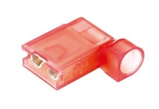
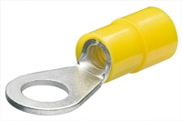
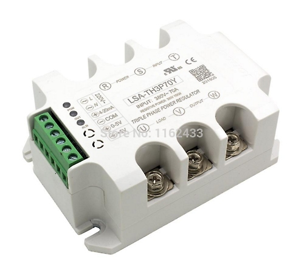

# NANOOK main control board

Nanook-mb is control board for open source [NANOOK ground-water heat pump](http://www.nanook.cc) project. The board is responsible for:

- soft-switching three phases compressor
- switching two circulation pumps
- controlling Carel Electronic Expansion Valve
- reading
  - safety low and high pressure switches
  - water temperature sensors on all exchanger ports (eight sensors in total)
  - water pressure sensors on cold and hot side
  - water flow sensors on cold and hot side
  - refrigerant pressure sensors on cold and hot side
- providing configuration web user interface via WiFi connection

## Safety warnings
TBD: grounding, connectors, switching (rocker vs. ext. CB)

## System connections

### Diagram

### Wiring

#### Mains to MB (#1)
Connection to mains is done by flexible cable 5x 2.5mm2. Mains side should be connected to on-wall box with dedicated circuit breaker (3x16A). Board side end must be terminated with insulated Faston 6.3 connectors and connected to L1, L2, L3 and N terminals of the board. To avoid contact with metal chassis, use angled Fastons only.

Ground wire must be terminated by crimp eye-type connector and mounted by screw to chassis.

### MB to compressor (#2)
This is, with #1, another high-current connection done by 3x 2.5mm2 cable. Both sides must be terminated by 6.3 Fastons. 

### MB to PWM SSR power lines (#3, #4)
These are six 2.5mm2 wires terminated by 6.3 Fastons on board side and by eye on SSR side. Make sure all six wires (R, S, T, U, V, W) are connected to properly.

### MB to ON/OFF switch (#5)
There is a rocker switch to turn heat pump ON and OFF. The switch just disconnects onboard power supply, which in turn opens onboard coil relays. This means that the board is still powered even with the rocker switch turned off.

### MB to PWM SSR control lines (#6, #7)
These lines connects main board and PWM SSR control circuit. Two lines supplies the control circuit with 230V AC power (#6). The other two are control signal 0-5V. Leave SSR contacts 4-20mA and +5V unconnected.

### Circulation pumps (#8, #9)
The main board directly controls primary (cold) and secondary (hot) side circulation pumps. Onboard SSRs are rated to 100W max power output.

### Safety pressure switches (#10, #11)